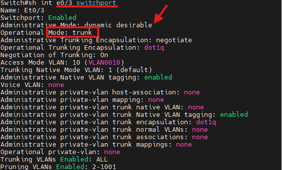
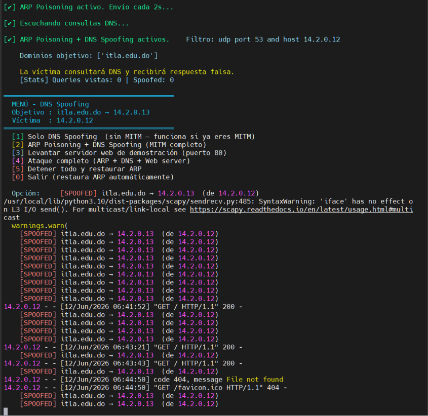
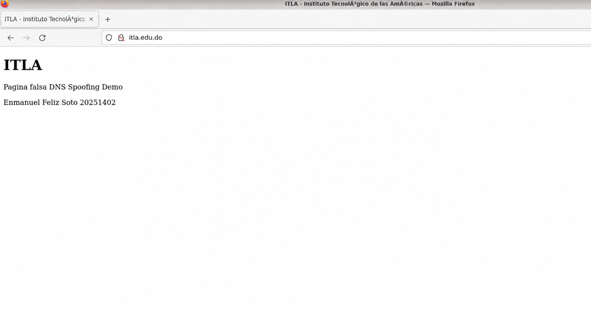
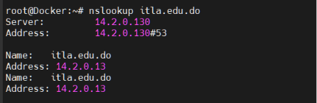

# Documentación Técnica de Laboratorio
## Ataques de Capa 2 y Capa de Aplicación en Redes Conmutadas
### VTP Attacks · DTP VLAN Hopping · DNS Spoofing / DNS Poisoning

| Campo | Valor |
|---|---|
| Estudiante | Enmanuel Feliz |
| Matrícula | 2025-1402 |
| Sección | 2-1C |
| Asignatura | Seguridad en Redes |
| Institución | Instituto Tecnológico de las Américas (ITLA) |
| Departamento | Tecnología de la Información y Sistemas (TSI) |
| Entorno de simulación | PNETLab (Cisco IOS + Docker) |

---

## 1. Objetivo del Laboratorio

Este repositorio documenta la ejecución de tres ataques clásicos a infraestructuras de red
conmutadas y de resolución de nombres, realizados en un entorno controlado de laboratorio
(PNETLab) con fines estrictamente académicos, bajo un contrato de ética firmado para la
asignatura de Seguridad en Redes.

El objetivo general es comprender, desde la perspectiva ofensiva, las debilidades de
configuración por defecto en switches Cisco (VTP y DTP) y en la resolución de nombres DNS
mediante ARP Poisoning, para luego documentar y aplicar las contramedidas correspondientes.

### Objetivos específicos
- Manipular el dominio VTP de un switch Cisco para inyectar y eliminar VLANs no autorizadas.
- Explotar la negociación automática de enlaces troncales (DTP) para convertir un puerto de
  acceso en un puerto troncal sin autorización administrativa.
- Realizar envenenamiento de caché ARP/DNS para suplantar la resolución del dominio
  `itla.edu.do` y redirigirla hacia un servicio web local controlado por el atacante.
- Documentar cada ataque junto con su respectiva contramedida de mitigación.

> **Nota ética:** Todas las pruebas descritas se ejecutaron exclusivamente dentro de un
> laboratorio virtual aislado (PNETLab), sin conexión a redes de producción ni a la
> infraestructura real de ITLA. Las técnicas aquí documentadas no deben aplicarse fuera de
> entornos autorizados.

---

## 2. Documentación de la Red

### 2.1 Topología General

*Figura 1. Topología general del laboratorio (PNETLab) — Enmanuel Feliz Soto, Matrícula 20251402.*

### 2.2 Direccionamiento e interfaces

| Dispositivo | Interfaz | Conexión | Función |
|---|---|---|---|
| Net (Cloud) | — | Router e0/1 | Salida a red externa / Internet del laboratorio |
| Router | e0/1 | Net | Enlace WAN |
| Router | e0/0 | Switch e0/0 | Enlace LAN hacia el switch |
| Switch | e0/0 | Router e0/0 | Trunk 802.1Q (VLANs 1, 10) |
| Switch | e0/1 | Docker (eth1) | Puerto de acceso — host Docker #1 |
| Switch | e0/2 | Docker (eth1) | Puerto de acceso — host Docker #2 (atacante) |
| Switch | e0/3 | Linux (e0) | Puerto de acceso (víctima de DTP Hopping) |

### 2.3 VLANs y dominio VTP

| Parámetro | Valor |
|---|---|
| Dominio VTP | `NetSec.local` |
| VLAN nativa | 1 (default) |
| VLANs activas en el enlace troncal Switch–Router | 1, 10 |
| Subred de los contenedores Docker (atacante) | 14.2.0.0/24 |
| Subred de gestión del laboratorio (evildead / Proxmox) | 10.0.0.0/24 |

### 2.4 Herramientas utilizadas
- **Sistema operativo de ataque:** Contenedor Docker basado en Linux con Python 3.
- **Librería principal:** `Scapy` (manipulación de tramas Ethernet, VTP, DTP, ARP y DNS a bajo nivel).
- **Dispositivo objetivo:** Switch Cisco IOS (emulado en PNETLab).
- **Captura y verificación:** Wireshark / tcpdump, y comandos `show` en el switch (`show vtp status`, `show interfaces trunk`, `show interface <int> switchport`).

---

## 3. Ataque 1 — VTP Attack (Inyección y Eliminación de VLANs)

### 3.1 Objetivo del ataque
VLAN Trunking Protocol (VTP) permite a los switches Cisco sincronizar su base de datos de VLANs
dentro de un mismo dominio de administración. Si un host atacante anuncia un número de revisión
de configuración (*configuration revision*) superior al del switch legítimo, este último
aceptará la nueva base de datos como autoritativa, permitiendo **agregar VLANs no autorizadas**
o **eliminar VLANs existentes** en toda la red, provocando interrupciones de conectividad
(denegación de servicio a nivel de capa 2).

### 3.2 Objetivo del script
El script `vtp_attack.py` construye y envía tramas VTP Summary Advertisement y Subset
Advertisement manualmente con Scapy, suplantando al switch legítimo dentro del dominio
`NetSec.local`, con el fin de:
- Anunciar una versión de configuración superior a la actual del switch víctima.
- Incluir una nueva VLAN dentro del Subset Advertisement (ataque de creación de VLAN).
- Enviar un Subset Advertisement sin una VLAN previamente existente (ataque de eliminación de VLAN).

#### 3.2.1 Parámetros usados

| Parámetro | Descripción |
|---|---|
| `--iface` | Interfaz de red por la cual se inyectan las tramas (ej. `eth1`). |
| `--domain` | Nombre del dominio VTP a suplantar (`NetSec.local`). |
| `--revision` | Número de revisión de configuración a anunciar; debe ser mayor al actual del switch víctima. |
| `--vlan-id` | Identificador numérico de la VLAN a crear o eliminar (ej. 999). |
| `--vlan-name` | Nombre de la VLAN a anunciar (modo creación). |
| `--mode` | `add` para agregar la VLAN, `delete` para excluirla del Subset Advertisement. |

#### 3.2.2 Requisitos para utilizar la herramienta
- Acceso de capa 2 al mismo dominio de difusión del switch (puerto de acceso conectado al switch víctima).
- Permisos de superusuario (`root`) para envío de tramas raw mediante Scapy.
- Python 3.10+ con la librería `scapy` instalada.
- Conocer el nombre del dominio VTP y la revisión de configuración actual (obtenible por captura pasiva o `show vtp status` si se tiene acceso previo).
- El switch víctima debe estar configurado en modo VTP **Server** o **Client** (no *Transparent*) para procesar los anuncios.

#### 3.2.3 Funcionamiento del script
1. Construye una trama Ethernet con destino multicast `01:00:0c:cc:cc:cc` (CDP/VTP/DTP) encapsulada en 802.1Q sobre VLAN 1 (nativa).
2. Construye la cabecera VTP (versión 2), tipo de mensaje *Summary Advertisement*, incluyendo el dominio, longitud del nombre de dominio y el número de revisión de configuración inyectado.
3. Construye un *Subset Advertisement* con la(s) VLAN(es) deseada(s): para el modo `add` incluye una entrada VLAN adicional con el ID y nombre especificados; para el modo `delete` omite la entrada de la VLAN objetivo respecto a la base de datos actual.
4. Envía las tramas mediante `sendp()` en la interfaz indicada.
5. El switch víctima recibe el anuncio, compara el número de revisión recibido contra el propio; al ser mayor, sincroniza su base de datos VTP, aplicando los cambios (alta o baja de VLAN) en toda la red del dominio.

### 3.3 Capturas de pantalla
> *Espacio reservado — Capturas de `show vtp status` y `show vlan brief` antes y después del ataque VTP.*

### 3.4 Contramedidas
- **VTP versión 3 con contraseña:** configurar `vtp password <clave>` y, de ser posible, `vtp version 3`, que añade autenticación más robusta y un servidor primario único.
- **VTP Transparent / desactivar VTP:** en switches donde no se requiera sincronización automática de VLANs, configurar `vtp mode transparent` para que el switch no procese ni propague anuncios VTP recibidos.
- **Port Security / control de acceso físico:** restringir qué dispositivos pueden conectarse a los puertos de acceso, evitando que un host no autorizado inyecte tramas hacia el dominio VTP.
- **Monitoreo:** habilitar alertas SNMP/Syslog ante cambios en el número de revisión de configuración VTP (`vtp status`) para detectar anomalías de forma temprana.

---

## 4. Ataque 2 — DTP VLAN Hopping (Conversión de Puerto Acceso a Troncal)

### 4.1 Objetivo del ataque
Dynamic Trunking Protocol (DTP) permite a los switches Cisco negociar automáticamente si un
enlace debe operar como puerto de acceso o como troncal 802.1Q. Cuando un puerto está
configurado en modo administrativo `dynamic desirable` (o `dynamic auto` frente a un extremo que
ofrece `desirable`), un host atacante puede enviar tramas DTP simulando ser un switch que desea
formar un enlace troncal. Si la negociación es aceptada, el puerto pasa de modo operativo *access*
a *trunk*, permitiendo al atacante recibir tráfico etiquetado de **todas las VLANs permitidas**
en ese enlace (VLAN Hopping).

### 4.2 Objetivo del script
El script `dtp_attack.py` genera y envía tramas DTP de tipo *Desirable* hacia el switch a través
del puerto `e0/3`, con el objetivo de forzar la renegociación del enlace y convertir dicho puerto
de **acceso (static access)** a **troncal (trunk)**, habilitando el etiquetado 802.1Q sobre todas
las VLANs permitidas.

#### 4.2.1 Parámetros usados

| Parámetro | Descripción |
|---|---|
| `--iface` | Interfaz Ethernet del host atacante conectada al puerto víctima del switch. |
| `--neighbor-type` | Tipo de negociación DTP a anunciar: `desirable` (recomendado) o `trunk`. |
| `--encap` | Tipo de encapsulación a negociar (802.1Q / ISL); por defecto 802.1Q. |
| `--interval` | Intervalo en segundos entre envíos sucesivos de tramas DTP (por defecto, similar al temporizador nativo de ~30s). |
| `--count` | Número de tramas DTP a enviar antes de finalizar la negociación. |

#### 4.2.2 Requisitos para utilizar la herramienta
- El puerto del switch al que se conecta el atacante debe estar en modo administrativo `dynamic auto` o `dynamic desirable` (configuración por defecto en muchos switches Cisco, como se observa en la Figura 2).
- Acceso de capa 2 directo al puerto objetivo (sin switches intermedios que filtren CDP/DTP).
- Python 3.10+ con `scapy`.
- Permisos de superusuario para el envío de tramas raw.

#### 4.2.3 Funcionamiento del script
1. Construye una trama Ethernet con MAC destino multicast `01:00:0c:cc:cc:cc`.
2. Encapsula un mensaje DTP versión 1 con los TLVs: *Domain*, *Status* (Desirable), *DTP Type* (802.1Q) y *Neighbor* (dirección MAC del host atacante).
3. Envía la trama de forma periódica mediante `sendp(..., loop=True, inter=interval)`.
4. El switch, al recibir el anuncio *Desirable* en un puerto configurado en `dynamic desirable`/`auto`, completa la negociación DTP y cambia su **Operational Mode** de `static access` a `trunk`.
5. A partir de ese momento, el atacante puede recibir tramas 802.1Q etiquetadas de todas las VLANs permitidas en el troncal (*Trunking VLANs Enabled: ALL*), pudiendo realizar sniffing entre VLANs o inyectar tráfico etiquetado hacia VLANs a las que normalmente no tendría acceso.

### 4.3 Capturas de pantalla

*Figura 2. Estado del puerto `Et0/3` ANTES del ataque DTP — `Administrative Mode: dynamic desirable`, `Operational Mode: static access`. El acceso a VLAN 10 aparece "Inactive".*

*Figura 3. Estado del puerto `Et0/3` DESPUÉS del ataque DTP — `Operational Mode: trunk`, encapsulación operativa `dot1q`, `Trunking VLANs Enabled: ALL`, VLAN 10 ahora activa (VLAN0010).*

### 4.4 Contramedidas
- **Desactivar DTP en puertos de acceso:** configurar `switchport mode access` junto con `switchport nonegotiate` en todos los puertos destinados a hosts finales, evitando cualquier negociación DTP.
- **No usar modos dinámicos:** evitar `dynamic auto` y `dynamic desirable` en interfaces de acceso; estos modos son la configuración por defecto y representan el principal vector del ataque demostrado.
- **Port Security:** limitar direcciones MAC por puerto para dificultar la suplantación de un dispositivo legítimo.
- **VLAN de acceso dedicada y no nativa:** asignar explícitamente cada puerto de acceso a su VLAN correspondiente y nunca a la VLAN nativa del troncal.

---

## 5. Ataque 3 — DNS Spoofing / DNS Poisoning (itla.edu.do)

### 5.1 Objetivo del ataque
El objetivo de este ataque es interceptar las consultas DNS realizadas por un host víctima hacia
el dominio `itla.edu.do` y responder de forma fraudulenta antes que el servidor DNS legítimo,
indicando que dicho dominio resuelve a la dirección IP de un servicio web local controlado por el
atacante. Para lograr la posición de "hombre en el medio" necesaria, el ataque se apoya en un
envenenamiento de caché ARP (ARP Poisoning) previo, que permite al atacante interceptar el
tráfico entre la víctima y su puerta de enlace.

### 5.2 Objetivo del script
El script `dns_spoof.py` combina dos funciones: (1) un módulo de ARP Poisoning que envenena las
tablas ARP de la víctima y de la puerta de enlace para situarse en la ruta del tráfico, y (2) un
sniffer/spoofer DNS que intercepta peticiones tipo A para `itla.edu.do` (y opcionalmente sus
subdominios) y responde con la IP del servicio web local del atacante.

#### 5.2.1 Parámetros usados

| Parámetro | Descripción |
|---|---|
| `--iface` | Interfaz de red del atacante usada para sniffing e inyección. |
| `--victim-ip` | Dirección IP del host víctima. |
| `--gateway-ip` | Dirección IP de la puerta de enlace / router. |
| `--target-domain` | Dominio a suplantar (`itla.edu.do`). |
| `--spoof-ip` | Dirección IP del servicio web local que se entregará como respuesta falsa. |
| `--arp-interval` | Intervalo en segundos entre cada par de tramas ARP gratuitas enviadas para mantener el envenenamiento. |

#### 5.2.2 Requisitos para utilizar la herramienta
- El atacante debe estar en el mismo segmento de capa 2 (misma VLAN/subred) que la víctima y la puerta de enlace.
- Python 3.10+ con `scapy`; habilitar reenvío de paquetes IP en el host atacante (`sysctl net.ipv4.ip_forward=1`) para no interrumpir la conectividad de la víctima.
- Servicio web local (ej. servidor HTTP/HTTPS de prueba) escuchando en la IP indicada en `--spoof-ip`, que simule un portal de ITLA.
- Permisos de superusuario para el envenenamiento ARP y el sniffing de paquetes UDP/53.

#### 5.2.3 Funcionamiento del script
1. **Fase de envenenamiento ARP:** el script envía periódicamente paquetes ARP "is-at" falsificados a la víctima (asociando la IP de la puerta de enlace con la MAC del atacante) y a la puerta de enlace (asociando la IP de la víctima con la MAC del atacante), situándose en medio de la comunicación.
2. **Sniffing de tráfico DNS:** mediante `scapy.sniff()` con filtro `udp port 53`, el script inspecciona cada consulta DNS que pasa por la interfaz.
3. **Filtrado por dominio:** si el campo *Question Name* de la consulta coincide con `itla.edu.do` (o el dominio configurado), el script construye una respuesta DNS falsificada.
4. **Construcción de la respuesta falsa:** se genera un paquete `IP/UDP/DNS` con los mismos campos de transacción (*Transaction ID*, puertos, direcciones origen/destino invertidos) que la consulta original, con un registro de respuesta tipo A que apunta a `--spoof-ip`.
5. **Envío de la respuesta:** la respuesta falsa se envía a la víctima antes de que llegue (o en lugar de) la respuesta legítima del servidor DNS real.
6. **Resultado:** el navegador de la víctima resuelve `itla.edu.do` a la IP del servicio web local del atacante y carga dicho contenido en lugar del sitio legítimo. En la prueba realizada (ver Figuras 4-6), la víctima `14.2.0.12` recibió como respuesta para `itla.edu.do` la IP `14.2.0.13` (atacante), en lugar de la IP legítima resuelta normalmente por el servidor DNS `14.2.0.130`.

### 5.3 Capturas de pantalla

*Figura 4. Ejecución del script de ARP Poisoning + DNS Spoofing: filtro `udp port 53 and host 14.2.0.12`, dominio objetivo `itla.edu.do` → `14.2.0.13`, víctima `14.2.0.12`. El log muestra cada consulta interceptada y la respuesta falsificada (`[SPOOFED] itla.edu.do → 14.2.0.13`), junto con las peticiones HTTP GET recibidas en el servidor web local de demostración.*

*Figura 5. Navegador de la víctima accediendo a `itla.edu.do`: en lugar del portal real de ITLA, se carga la página falsa servida localmente por el atacante ("Pagina falsa DNS Spoofing Demo — Enmanuel Feliz Soto 20251402"), confirmando que la resolución del dominio fue exitosamente suplantada.*

*Figura 6. Resultado de `nslookup itla.edu.do` ejecutado en la víctima: el servidor DNS consultado (`14.2.0.130`) responde que `itla.edu.do` resuelve a `14.2.0.13` (IP del atacante), en lugar de la IP legítima, confirmando el envenenamiento de la resolución DNS.*

### 5.4 Contramedidas
- **Dynamic ARP Inspection (DAI):** habilitar DAI en los switches, validando las asociaciones IP-MAC contra la tabla de DHCP Snooping, descartando paquetes ARP no válidos.
- **DHCP Snooping:** requisito previo para DAI; evita que hosts no autorizados respondan a peticiones DHCP y construye la base de confianza IP-MAC-puerto.
- **Port Security:** limitar y fijar las direcciones MAC permitidas por puerto.
- **DNSSEC:** firmar digitalmente las zonas DNS (`itla.edu.do`) para que los resolutores puedan validar la autenticidad de las respuestas y rechazar registros falsificados.
- **DNS sobre TLS/HTTPS (DoT/DoH) y HTTPS con HSTS:** cifrar las consultas DNS y forzar conexiones HTTPS para que un sitio falso no pueda presentar un certificado válido del dominio real.
- **Monitoreo de IDS/IPS:** detectar patrones de ARP gratuitos repetidos y respuestas DNS duplicadas/anómalas para la misma transacción.

---

## 6. Entregables del Laboratorio

### 6.1 Estructura de repositorios

| Ataque | Script | Repositorio / Carpeta |
|---|---|---|
| VTP Attack (alta/baja de VLAN) | `vtp_attack.py` | `NetSec/Semana 4 DNS - DTP - VTP/VTP` |
| DTP VLAN Hopping | `dtp_attack.py` | `NetSec/Semana 4 DNS - DTP - VTP/DTP` |
| DNS Spoofing/Poisoning | `dns_spoof.py` | `NetSec/Semana 4 DNS - DTP - VTP/DNS` |

### 6.2 Contenido por repositorio/carpeta
- Video demostrativo (máx. 5 minutos): topología visible con nombre y matrícula, hora y fecha visibles, rostro y voz del estudiante, demostración del ataque y de la contramedida.
- Script de la herramienta (`.py`) con comentarios.
- Capturas de pantalla del antes/después de cada ataque (incluidas en este README).

> La documentación técnica completa en PDF (formato de entrega para el profesor) se
> encuentra como archivo aparte y **no se incluye dentro de este repositorio**; este
> README contiene el mismo contenido en formato Markdown.

### 6.3 Lista de reproducción de YouTube
> *Espacio reservado — Enlace a la lista de reproducción con los tres videos: VTP Attack, DTP VLAN Hopping, DNS Spoofing/Poisoning.*

### 6.4 Enlaces de repositorios
> *Espacio reservado — Enlaces finales a los repositorios/subcarpetas individuales por script (VTP, DTP, DNS).*

---

## 7. Conclusiones

Los tres ataques demostrados (VTP, DTP VLAN Hopping y DNS Spoofing/ARP Poisoning) explotan
configuraciones por defecto que priorizan la conveniencia operativa sobre la seguridad: dominios
VTP sin autenticación, puertos en modos de negociación dinámica de troncales, y resolución de
nombres sin verificación criptográfica de origen ni protección de la tabla ARP. En todos los
casos, las contramedidas presentadas no requieren hardware adicional, sino una correcta
configuración de las funciones de seguridad ya disponibles en los switches Cisco (VTP con
contraseña o modo transparente, `switchport nonegotiate`, DHCP Snooping y Dynamic ARP Inspection)
junto con buenas prácticas de capa de aplicación (DNSSEC, HTTPS/HSTS). Esto refuerza la
importancia de aplicar el principio de menor privilegio y "seguro por defecto" en el diseño de
redes conmutadas.
